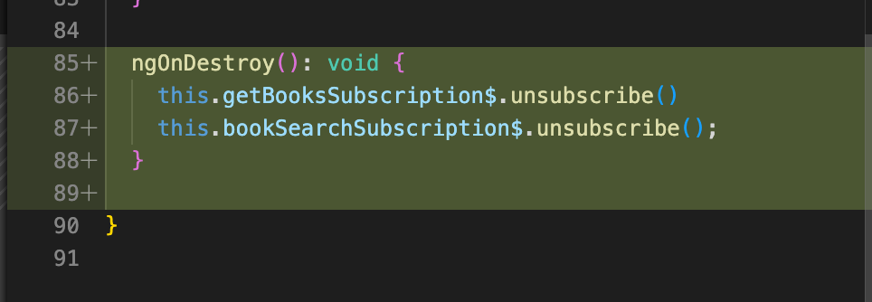
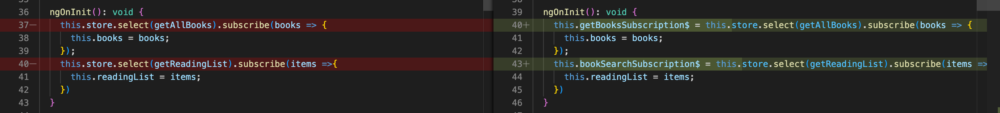
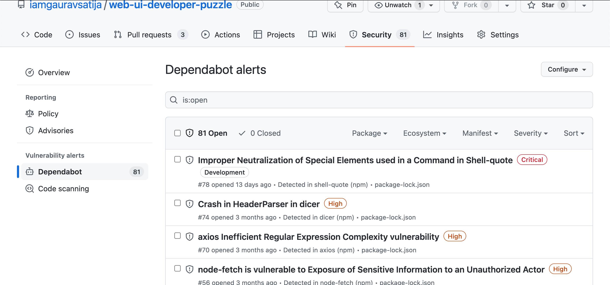
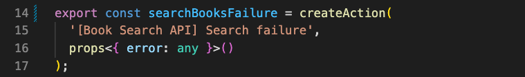
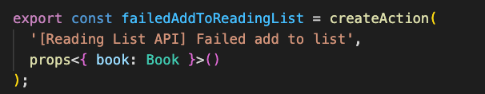

# Code Review Document

## Code Review

**Are there any problems or code smells in the app? (Focus on code in the `libs/books` folder)**

After going through the code I found following problems in the code under `libs/books`

- **Memory Leak:** In the book-search.component.ts `getBooks` and `readingList` subscribtions where never unsubscribed. So, I used Angular's OnDestroy function to unscrubscibe the above.

2. **Security Vulnerability:** Upgrading Angular library and other dependencies to improve security. I fix this I will take the following steps:
    - Run `npm audit` and `npm outdated` to get list of all the packages that needs to be updated
    - Go to the npm registry and package's pages and look through the **Breaking Changes** section. This will help in understanding where all we might need to update the code.
    - NOw, use `npm update package_name` to update packages one by one.

    

4. **Formatting:** We can also improve the code readability and formatting by running *Prettier* and *ESLint*.

**Are there other improvements you would make to the app? What are they and why?**

5. Everytime I add or remove a book from the reading-list it refreshes the whole component. I would like to change that in such a way that when a book is added or removed on that book's component is refreshed, or is affected, not the whole list component.

6. **Action name inconsistency:** There are some inconsistency in the name of the actions for example *Failure* action in the [books.action.ts](libs/books/data-access/src/lib/+state/books.actions.ts) file and [reading-list.actions.ts](libs/books/data-access/src/lib/+state/reading-list.actions.ts) as shown below:

## LightHouse Extension accessibility Improvement

After running LightHouse extension following two accessibility issues detected:

1. Search button don't have accessibility name:
2. Background and foreground colors do not have a sufficient contrast ratio.

## Manual Accessibility Checklist

- Able to navigate with help of only keyboard. ✅
- Turned off images and still content was understandable. ✅
- Color of Nav bar `(#fc4081)` is not same as T-Mobile's logo color `(#e20474)`.
